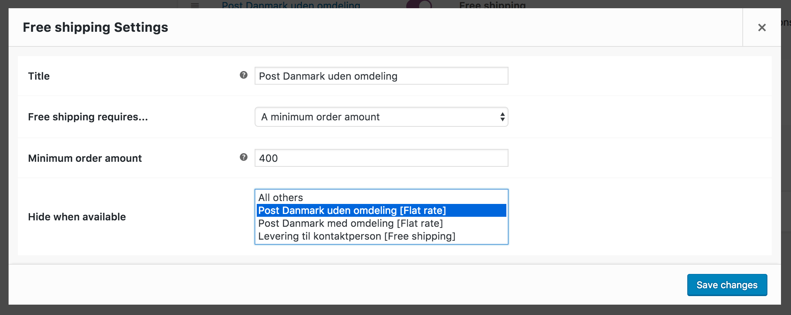

# WooCommerce Shipping Method Display
This plugin aims to put you in control of how and when shipping methods are displayed on your WooCommerce store.

## Hide specificed shipping methods when available
Often you want to hide all or certain shipping methods when a specific shipping method is available. Maybe you have free shipping over a threshold and want to provide "Free Standard Delivery" and hide your "Standard Delivery" shipping option. This plugin allows you to do just that.

Currently this is the only feature supported but more might be added in the future.

## Screenshots
